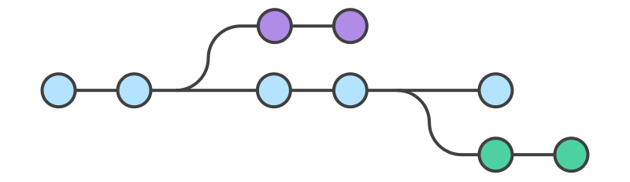
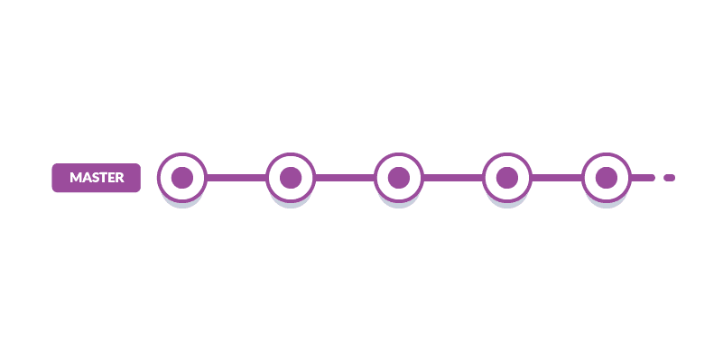

# Samenwerken met Git

Ondertussen hebben jullie al wat ervaring kunnen opdoen met `git`. Git is een
fantastische tool om onze broncode te gaan beheren. Naast het beheren van je
aanpassingen in _commit's_, laat Git ook toe eenvoudig te gaan samenwerken
met andere developers. Hier gaan we in op een paar nieuwe eigenschappen van git
die jullie gaan helpen om samen te werken aan 1 project.

## Experimenteren met `git branch`

Wanneer je aan een project werkt, weet je meestal nog niet heel zeker of hetgeen
je aan het proberen bent ook effectief zal lukken. Git laat toe om deze
experimenten te gaan isoleren zodat je niet bang hoeft te zijn dat je reeds
werkende code niet verloren gaat. Zeker wanneer je met meerdere mensen aan één
project werkt is het heel belangrijk dat jouw experiment de andere ontwikkelaars
niet hindert.

Git lost dit probleem volledig op met een eigenschap dat _branching_
heet. Letterlijk vertaald betekend dit '_vertakken_'.

[Lees hier meer over het `git branch` commando](https://www.atlassian.com/git/tutorials/using-branches).

### Werken aan andere experimenten

Soms kan het gebeuren dat je van branch wil veranderen. Er zijn tal van redenen
waarvoor je dit zou kunnen doen. Misschien zit je vast en wil je aan iets anders
beginnen, of wil je helpen met iemand anders experiment.

Git laat toe ten alle tijde van branch te veranderen. Dit kan met het `git checkout`
commando. De toestand van je project wordt dan aangepast naar de toestand uit die
branch. Let wel op dat alles gecommit moet zijn voor je van branch kan veranderen.
Indien dit niet het geval is zou je werk kunnen verliezen. Git zal dit niet toelaten.

[Lees hier meer over het `git checkout` commando](https://www.atlassian.com/git/tutorials/using-branches/git-checkout)

## Geslaagde experimenten behouden met `git merge`

Met `git branch` kan je eenvoudig experimenten in je code gaan isoleren. Experimenten
kunnen slagen, maar kunnen ook falen. Indien ze falen is het het vrij eenvoudig
om je code ongedaan te maken. Je kan gewoon terug keren naar een werkende branch.
De falende branch kan je weggooien, of laten ter referentie, of om later eens naar
te kijken.

Indien een experiment slaagt wil je dit ook in het project gaan integreren. Het
integreren is belangrijk omdat het nieuwe functionaliteit toevoegt in je project,
maar het is ook belangrijk omdat je via die weg de nieuwe functionaliteit kan delen
met de andere ontwikkelaars in het project.

Git lost dit op met een eigenschap dat _mergen_ heet. Letterlijk vertaald betekend
dit _samensmelten_. Het laat dan ook toe je experiment toe te voegen aan je project.

[Lees hier meer over het `git merge` commando]([./git/merging.md](https://www.atlassian.com/git/tutorials/using-branches/git-merge))

### Mergeconflicten

Git kan verschillende aanpassingen van verschillende mensen meestal goed samenvoegen.
Soms kan het echter misgaan bij het mergen. Dit heet een mergeconflict. De voorwaarde
om een mergeconflict te krijgen is dat er in verschillende branches een zelfde regel
code gewijzigd is.

Indien er een mergeconflict optreedt, dan zal git de aanpassingen nog niet committen.
Het is dan de bedoeling dat je zelf de conflicten oplost. VSCode laat toe deze conflicten
eenvoudig op te lossen. Voor meer informatie over hoe je dit in VSCode kunt doen
kan je deze [video](https://www.youtube.com/watch?v=lXPYqVjyqHM) bekijken.

Bij mergeconflicten moet je nagaan welke code (uit welke branch) je wil behouden.
Dit betekend dat je zelf moet beslissen welke code je wenst te behouden. Vaak komt
het ook voor dat je code uit beide branches wil behouden. Het is in dat geval aan
de programmeur om te bepalen hoe dit het best kan. Het is in elk geval dan niet de
bedoeling de code van de andere persoon weg te gooien.

[Lees hier meer over mergeconflicten en hoe je ze kan oplossen](https://www.atlassian.com/git/tutorials/using-branches/merge-conflicts)

## Samenwerken met `remotes`

Met branching en merging, werken je nog steeds lokaal op je eigen computer. Maar
uiteindelijk wil je ook je resultaten delen met de andere ontwikkelaars binnen je
project of groep. Daarvoor kan je werken met _remotes_. Remotes zijn eigenlijk gewoon
kopieën van het project die op een publieke server staan. Iedereen die aan
het project werkt kan via die server toegang krijgen tot alle experimenten en de
code. Eigenlijk is dit niets nieuws voor jullie. De server die wij hiervoor gebruiken
wordt voorzien door GitHub.

Je geslaagde (maar zeker ook gefaalde) experimenten kan je delen met de andere ontwikkelaars
via zo een remote. Daarvoor kan je de commando's `push` en `pull` gaan gebruiken.
Deze commando's zou je ondertussen reeds moeten kennen.

## Git Workflows

Remotes, branching en merging zijn een aantal eenvoudige eigenschappen die het samenwerken
vereenvoudigen. Echter kan je deze principes op verschillende manieren gaan toepassen
en implementeren. Er bestaan echter een aantal manieren, ook wel workflows genoemd,
die deze principes op een specifieke manier toepassen, of hierover wat richtlijnen
vermelden.

We bespreken kort een workflow die jullie kan helpen bij het samenwerken.

### Tot nu toe

Tot nu toe werkten jullie steeds alleen aan een project. Er was op zich geen nood
aan het branche en mergen (hoewel je dit vanaf nu ook perfect kan toepassen op
individuele projecten).

De geschiedenis van je project zag er dan ook heel lineair uit:

### Feature branches

Wanneer je samenwerkt kan het handig zijn om met **feature branches** te werken.
Dat wil zeggen dat elk feature (en dus elk experiment) een eigen branch krijgt.
Geslaagde experimenten worden dan in de `master` branch gemerged.

Heel belangrijk bij deze manier van werken is om héél regelmatig je feature branches
te mergen met de master. Blijf niet dagenlang op een feature branch werken om dan
pas te gaan mergen. Dit zal leiden tot veel mergeconflicten en dit zal niet aangenaam
zijn om op te lossen.

De oplossing is om je feature branch continue te mergen met de master branch. Doe
dit telkens er nieuwe functionaliteit toegevoegd is op de master branch. Hierdoor
worden eventuele mergeconflicten klein en beheersbaar. Dit houdt het samenwerken
ook zeer aangenaam en eenvoudig. Doe je dit niet regelmatig, dan zal het samenwerken
moeilijk of zelfs onmogelijk worden.

<iframe width="800" height="450"
src="https://www.youtube.com/embed/q3gwZ3Q-s2s"
frameborder="0"
allow="accelerometer; autoplay; encrypted-media; gyroscope; picture-in-picture" allowfullscreen></iframe>
