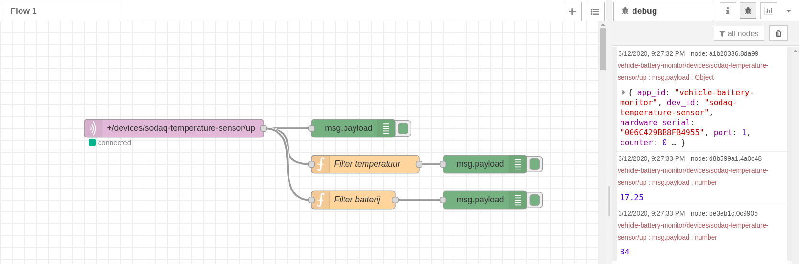

<!-- markdownlint-disable MD013 -->
# Tools

## App Inventor

App Inventor is een web-gebaseerde ontwikkelingsomgeving voor het ontwikkelen van apps.

[Website](http://appinventor.mit.edu/)
[Tutorial](https://www.youtube.com/watch?v=Vdo8UdkgDD8)

## Arduino

Arduino is een open-source prototyping platform voor microcontrollers.

[Website](https://www.arduino.cc/)
[Tutorial](https://www.youtube.com/watch?v=fJWR7dBuc18)

## ESP8266

De ESP8266 is een serie zeer goedkope microcontrollers die WiFi ondersteunen.

[Website](http://esp8266.net/)
[Tutorial](https://www.youtube.com/watch?v=Ao5XcORsYxA)

## Git

[Website](https://git-scm.com/)
Tutorial

## Raspberry Pi

[Website](https://www.raspberrypi.org/)
Tutorial

## Docker

Docker is een tool om software in een geisoleerde omgeving te draaien. Docker gebruikt daarvoor een techniek die containerization noemt.

* [Tutorial](http://vives.gitbook.io/docker)

## MQTT

MQTT is één van de meest gebruikte protocollen voor Internet of Things apparaten te laten communiceren met elkaar.

MQTT staat voor Message Queuing Telemetry Transport. Het is een zeer lichtgewicht berichten protocol dat gebruik maakt van publish/subscribe mechanisme om gegevens tussen verschillende clients uit te wisselen.

* [MQTT Essentials](https://www.hivemq.com/mqtt-essentials/)
* [MQTT NodeRed](https://www.youtube.com/watch?v=amA5OaXXCJo)
* [MQTT C#](https://github.com/chkr1011/MQTTnet)
  * [Wiki](https://github.com/chkr1011/MQTTnet/wiki)
  * [Demo Code](git@github.com:BioBoost/DotNetMQTTDemo.git)
* [MQTT NodeJS](https://blog.risingstack.com/getting-started-with-nodejs-and-mqtt/)

## Node RED

Node-RED is een flow gebaseerde visuele ontwikkelomgeving ontwikkeld door IBM. Het laat toe hardware toestellen, API's en online diensten met elkaar te communiceren in het teken van het Internet of Things.

Het biedt een browsergebaseerde editor die het gemakkelijk maakt om flows met elkaar te verbinden met behulp van het brede scala aan nodes die met een klik kunnen worden ingezet tijdens de uitvoering.

* [Website](https://nodered.org/)
* [Installation](https://nodered.org/docs/getting-started/local)
* [NodeRED Cookbook](https://cookbook.nodered.org/)
* [NodeRED Dashboard Tutorial](https://youtu.be/X8ustpkAJ-U?t=105)

## Openshot

Openshot is een open-source video editor.

[Website](https://www.openshot.org/)
[Tutorial](https://www.youtube.com/watch?v=l_r12b99TIg)

## REST

Website
Tutorial

## Wordpress

Wordpress is een gratis Content Management System (CMS), een tool om websites te maken.

[Website](https://wordpress.com/)
[Tutorial](https://www.youtube.com/watch?v=8OBfr46Y0cQ)
